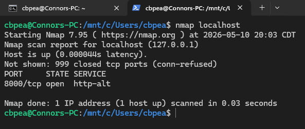

# Nmap Port Scanning

## Overview
In this project, I used Nmap within a Linux (WSL) command-line environment to perform a basic port scan on my local machine and identify exposed network services.

## What I Did
- Used Nmap in a Linux terminal environment (WSL)
- Started a local HTTP server using Python
- Performed a scan against localhost
- Identified open TCP ports and associated services
- Analyzed scan results to understand basic network exposure

## Key Findings
- Identified an open HTTP service running on port 8000
- Observed how Nmap detects open ports and associated services
- Learned how exposed services increase a system’s attack surface
- Gained experience performing basic network reconnaissance

## Commands Used

```bash
python3 -m http.server 8000
nmap localhost
```

## Tools Used
- Nmap
- WSL (Windows Subsystem for Linux)
- Python HTTP Server

## Screenshots

### Nmap Scan Results


## What I Learned
This project helped me understand how port scanning works and how security professionals identify exposed services on a system. I also gained hands-on experience using Nmap in a Linux command-line environment.
